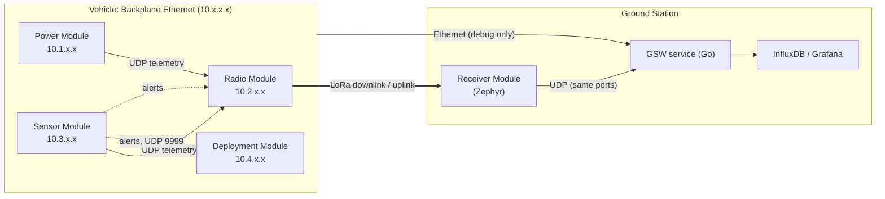
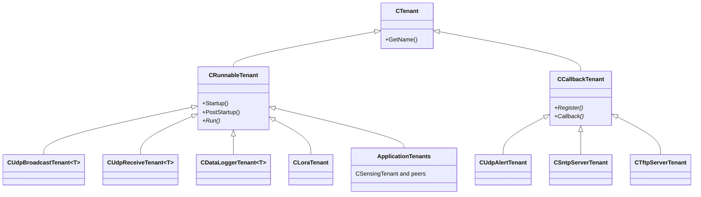
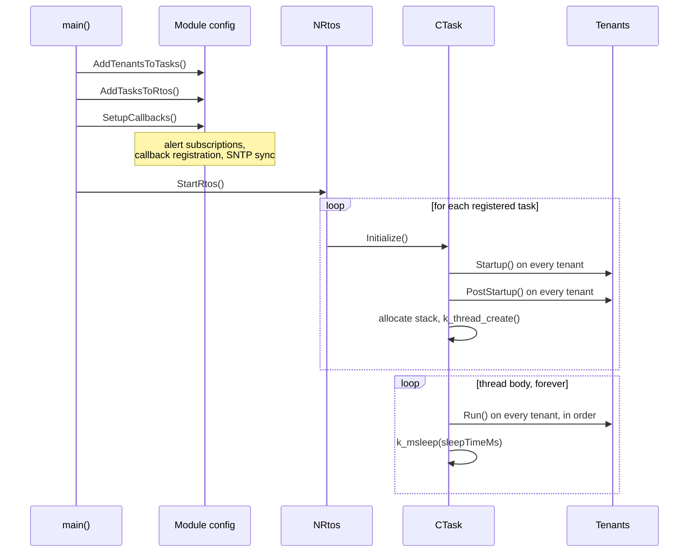
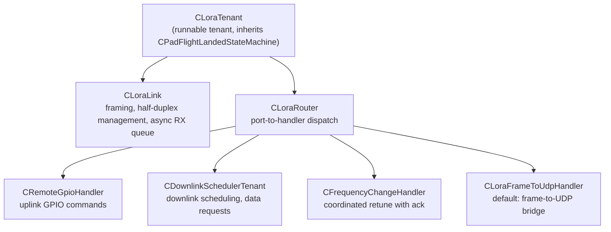
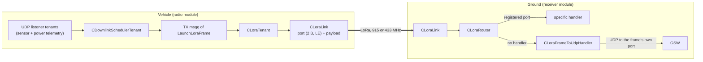
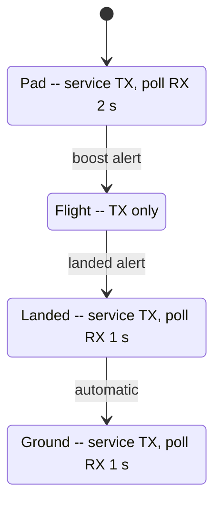
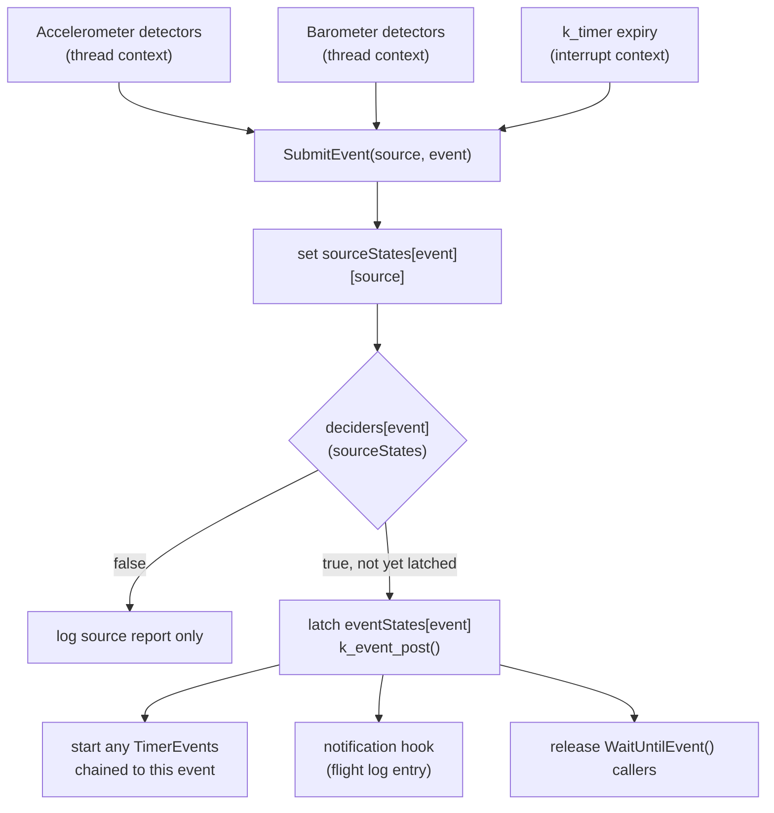
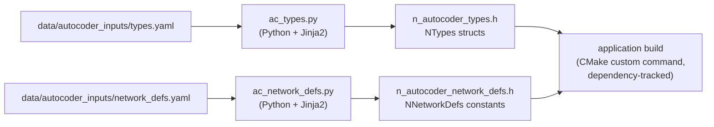

# RIT Launch Initiative Flight Software Developer's Guide

## Table of Contents

- [1. Introduction](#1-introduction)
- [2. Architecture](#2-architecture)
- [3. Zephyr RTOS Fundamentals](#3-zephyr-rtos-fundamentals)
- [4. The F-Core Framework](#4-the-f-core-framework)
- [5. Autocoders](#5-autocoders)
- [6. Build System and Simulation](#6-build-system-and-simulation)
- [7. Debugging and Fault Analysis](#7-debugging-and-fault-analysis)
- [8. Development Guidelines](#8-development-guidelines)

## 1. Introduction

### 1.1 Purpose

This guide covers F-Core and Backplane firmware architecture, application structure, development, and debugging. It assumes proficiency in C++ and basic embedded systems knowledge. New contributors should read Sections 1 through 4 before changing code.

### 1.2 Scope

The guide covers the F-Core framework, Backplane applications, autocoders, build system, simulation, and debugging.

### 1.3 System Overview

The Backplane is a modular, student-researched-and-developed (SRAD) avionics system. Independent STM32-based modules communicate over Ethernet and run firmware built from this repository.

The flight modules and their responsibilities:

| Module | Responsibility | Principal Hardware |
| --- | --- | --- |
| Sensor Module | Samples inertial and barometric sensors, performs flight event detection, broadcasts telemetry | LSM6DSL IMU, ADXL375 high-g accelerometer, BMP388 and MS5611 barometers, magnetometer |
| Power Module | Monitors power rails and broadcasts electrical telemetry | INA219 shunt monitors (battery, 3.3 V, 5 V rails) |
| Radio Module | Aggregates telemetry from other modules, downlinks over LoRa, processes uplink commands, serves network time, logs GNSS | RFM95W LoRa transceiver, GNSS receiver |
| Deployment Module | Actuates pyrotechnic channels for recovery events in response to flight event alerts | Pyrotechnic output channels |

Two additional components complete the system:

- **Ground Receiver Module** — receives LoRa frames and forwards them as UDP packets.

### 1.4 Guiding Principles

- Prefer compile-time checks and static allocation.
- Keep hardware details in devicetree and software options in Kconfig.
- Pass data between tenants through typed message ports.
- Validate logic in simulation, then validate timing and hardware behavior on the target.

## 2. Architecture

### 2.1 Structural Overview

Every flight application follows the same structure. A module is described by a single configuration class derived from `CProjectConfiguration`. The configuration class declares, as members:

- **Devices** — hardware abstractions resolved from the devicetree.
- **Message ports** — typed, thread-safe channels through which data moves.
- **Tenants** — units of application functionality, each performing one job (sample sensors, broadcast telemetry, log data, etc.).
- **Tasks** — RTOS threads, each of which periodically executes an ordered list of tenants.
Data flows through message ports. Producers and consumers are connected by constructor injection in the configuration class, with all wiring fixed at compile time.



*Figure 1. Backplane and ground-system data flow.*

### 2.2 Rationale, Benefits, and Tradeoffs

#### 2.2.1 Static Wiring Versus Dynamic Composition

All tenants, tasks, ports, and devices are wired at compile time. This turns type and connection errors into build failures, but topology changes require rebuilding and reflashing. F-Core does not support in-flight reconfiguration.

#### 2.2.2 Tenant and Task Decoupling Versus One Thread Per Feature

Multiple tenants share each RTOS task to reduce stack memory. They run sequentially, so one slow or blocking tenant delays all later tenants in that task.

#### 2.2.3 Message Passing Versus Direct Calls

Tenants communicate through `CMessagePort<T>` rather than direct calls, which makes producers and consumers replaceable. `CMsgqMessagePort` supports multiple producers and consumers through Zephyr's `k_msgq`. `CLatestMessagePort` uses a seqlock and supports exactly one producer with any number of readers. Use a queued port or another synchronization primitive when multiple producers are required.

#### 2.2.4 Sensor Redundancy and Decision Fusion

Flight-critical acceleration and altitude measurements use two different sensor models. Per-event decision functions combine source states and may fall back to a sensor marked healthy by `SensorWorkings`. This improves fault tolerance at the cost of more states and code paths to test.

### 2.3 Networking Architecture

#### 2.3.1 Addressing and Port Scheme

The Backplane is a flat IPv4 network using `10.<module_id>.<board>.<instance>`. Power, radio, sensor, and deployment use module IDs 1 through 4 and base ports 11000 through 14000. Service offsets are defined in `network_defs.yaml` and generated by the autocoder. Application code must not contain literal addresses or ports.

#### 2.3.2 UDP Broadcast

Telemetry uses UDP broadcast because current samples matter more than retransmitting old ones, and new listeners require no sender configuration. UDP provides no delivery or ordering guarantee. Broadcast also reaches every device on the segment, which is acceptable at the current network size and data rate.

#### 2.3.3 Where Reliability Was Added Anyway

The frequency-change command adds an application-level acknowledgment because changing only one radio would sever the link. Apply the same pattern to new commands when a dropped packet could cause an unrecoverable state mismatch.

#### 2.3.4 What the Network Does Not Protect Against

The Backplane network has no encryption or authentication. Any correctly formatted packet is accepted, so the design assumes a closed pad network and isolated RF link. LoRa frames preserve UDP port numbers and payloads, allowing ground software to process radio and umbilical telemetry identically.

---

## 3. Zephyr RTOS Fundamentals

F-Core is a thin layer over Zephyr. The [Zephyr documentation](https://docs.zephyrproject.org/) is authoritative. This section summarizes the concepts most important to FSW.

### 3.1 Scheduling

Zephyr is a preemptive, priority-based RTOS.

- **Lower numeric priority is higher scheduling priority.** A priority 13 thread preempts a priority 15 thread the moment it becomes ready.
- **Equal-priority threads do not preempt one another.** They run until they block, sleep, or yield, unless time slicing is enabled for that priority level.
- **Negative priorities are cooperative** and cannot be preempted. Application code does not use them, but Zephyr's own subsystems (networking, logging, work queues) do. A starved application thread is frequently explained by activity in these system threads.

### 3.2 Kernel Objects

All Zephyr primitives — `k_thread`, `k_msgq`, `k_timer`, `k_event`, `k_mutex`, `k_sem` — are structures that register themselves with the kernel by address. Two consequences dominate F-Core's design rules:

1. **Kernel objects require stable addresses for their entire lifetime.** A C++ object containing a kernel object must never be copied or moved: the copy contains a kernel structure the kernel does not know about, and destruction of either object can corrupt kernel bookkeeping. Classes wrapping kernel objects must delete their copy constructors (`CPhaseController` does this and documents why). Violation of this rule would cause a bus fault.
2. **Timer and event callbacks execute in interrupt context.** Any function reachable from a `k_timer` expiry must be interrupt-safe: no blocking, no I/O, no sleeping. The phase controller's decision functions are subject to this constraint (Section 4.9).

### 3.3 Execution Contexts

Application tenants are not the only code running. Zephyr operates a main thread, an idle thread, a system work queue, network RX and TX threads, a logging thread, and socket service threads. Callback-driven tenants and radio receive callbacks execute in these foreign contexts. The rules:

- Code executing in a socket service or work queue context must be brief and must not block since a stall there stalls the subsystem for every user.
- Sleeping (`k_msleep`) in an interrupt or callback context is a fault. `k_is_in_isr()` is available where context is uncertain.
- Logging is deferred by default (`CONFIG_LOG_MODE_DEFERRED`): output can lag the event that produced it, and buffered messages are lost in a crash. Section 7 covers the implications for debugging.

### 3.4 Devicetree and Kconfig

Hardware description and software configuration are separated:

- **Devicetree** (`.dts`, `.overlay` files) describes what hardware exists: which sensors are on which buses, flash partition layout, filesystem mounts. Application code refers to hardware only through **aliases** (`DT_ALIAS(primary_barometer)`), never through chip-specific node names. This indirection is what allows the same application source to build for flight hardware, for `native_sim`, and for hardware-in-the-loop simulation overlays.
- **Kconfig** (`prj.conf`, extra `.conf` files) enables and tunes software features: drivers, network stack options, logging, debug facilities. Build variants such as the 433 MHz licensed-band radio build are expressed as extra Kconfig fragments rather than source changes.

### 3.5 The native_sim Target

`native_sim` builds the application as a Linux process against a simulated kernel, simulated flash, and simulated devices. Its purpose is logic verification with fast iteration and full host tooling (gdb, valgrind, sanitizers). Two caveats:

- Simulated time and wall time are decoupled. Simulation validates logic, while hardware validates timing.
- The POSIX architecture does not idle the CPU automatically, which is why the task entry loop calls `k_cpu_idle()` under `CONFIG_ARCH_POSIX`, and why simulation builds of `main()` run for a fixed simulated duration and then stop the RTOS explicitly.

---

## 4. The F-Core Framework

F-Core resides in `include/f_core/` and `lib/f_core/`, organized by concern:

```text
f_core/
├── os/          Tasks, tenants, RTOS interface, data logger, flight log
├── messaging/   Message port interface and implementations
├── net/         network/ (IPv4), transport/ (UDP sockets), application/ (tenants)
├── radio/       LoRa device, link, router, frame handlers, LoRa tenant
├── device/      RTC and sensor device abstractions
├── flight/      Phase controller (flight event detection)
├── state_machine/  Pad/Flight/Landed state machine
└── utils/       Observer, soft timer, hash map, debouncer, linear fit
```

### 4.1 Conventions

- `CFoo` — class. `NFoo` — namespace. Files are named `c_foo.h/.cpp` and `n_foo.h` accordingly.
- Generated headers carry the prefix `n_autocoder_` and are emitted into the build tree (`zephyr/include/generated/FSW/`). They are build artifacts: never edited, never committed. The YAML inputs in `data/autocoder_inputs/` are the source of truth (Section 5).
- Framework code (F-Core proper) is held to a stricter standard than application code: framework tenants must be non-blocking. Application tenants may block with documented awareness of their task-mates.

### 4.2 Tenants

A tenant is the unit of application functionality. The class hierarchy:



*Figure 2. The tenant class hierarchy. Runnable tenants are executed periodically by a `CTask`. Callback tenants are invoked by the kernel through the socket service facility and belong to no task.*

#### 4.2.1 CRunnableTenant

The runnable tenant contract has three phases:

- **`Startup()`** — resource and hardware initialization. Called once per tenant, before any task thread exists.
- **`PostStartup()`** — initialization that depends on other tenants in the same task having completed `Startup()`. The two-phase pattern resolves initialization ordering dependencies without global sequencing logic.
- **`Run()`** — invoked repeatedly by the owning task. Framework tenants must return promptly. Application tenants that block must account for other tenants sharing their thread.

#### 4.2.2 CCallbackTenant

Callback tenants do not participate in any task loop. `Register()` attaches the tenant to Zephyr's socket service facility (`net_socket_service`), and the kernel invokes `Callback()` from a network work-queue context when data arrives on the tenant's socket. This provides immediate reaction to network events without a dedicated polling thread. The cost is the context: a callback executes on a shared system thread and must be treated like an interrupt handler — short, non-blocking, no filesystem or bus I/O. The registration plumbing lives in `lib/f_core/net/application/socket_service_handlers.c`, where each service is declared with `NET_SOCKET_SERVICE_SYNC_DEFINE`. A new callback tenant type requires a corresponding entry there.

#### 4.2.3 CObserver

`CObserver` defines one method, `Notify(void* ctx)`. The alert tenant calls it when a valid alert arrives. Because the call runs outside the tenant's owning thread, treat it like an interrupt. Only set flags or post to a message port. Perform heavier work in the observer's task.

### 4.3 Tasks and the RTOS Interface

#### 4.3.1 CTask

`CTask(name, priority, stackSize, sleepTimeMs)` encapsulates one Zephyr thread. The thread body executes, indefinitely:

```cpp
void CTask::Run() {
    for (CRunnableTenant* tenant : tenants) {
        tenant->Run();
    }
    k_msleep(sleepTimeMs);
}
```

This is the F Prime rate group model, and its properties must be understood precisely:

- **Tenants execute sequentially, in registration order.** A slow tenant delays every tenant registered after it. Scheduling within a task is cooperative even though the RTOS beneath it is preemptive.
- **`sleepTimeMs` is a sleep, not a period.** If tenants consume 7 ms and sleep for 10 ms, the cycle is about 17 ms. Fixed-rate subsystems need an absolute deadline such as `k_sleep(K_TIMEOUT_ABS_MS(...))` or a `k_timer` gating a semaphore.
- **`Initialize()`** runs `Startup()` on every tenant, then `PostStartup()` on every tenant, then allocates the thread stack with `k_thread_stack_alloc()` and creates the thread. Stack allocation failure panics immediately (`k_panic()`), so an undersized heap manifests at boot, not in flight. The thread name identifies the task in fault dumps and shell output (Section 7).
- The destructor aborts the thread and frees the stack. it exists for simulation shutdown and unit tests, not for flight paths.

#### 4.3.2 NRtos

`NRtos` is a task registry, not a scheduler. `AddTask()` records a task. `StartRtos()` initializes tasks in order and maps names to thread IDs. Tasks can be suspended or resumed by name or ID. `StopRtos()` supports orderly simulation shutdown.

#### 4.3.3 Priority Assignment

Priorities are a design decision per module. The sensor module is the instructive example:

| Task | Priority | Stack (bytes) | Sleep (ms) |
| --- | --- | --- | --- |
| Data Logging | 13 | 4096 | 5 |
| Sensing | 14 | 4096 | 10 |
| Networking | 15 | 3072 | 10 |

Data logging outranks sensing, which outranks networking. Losing queued log data is unrecoverable, while a delayed UDP broadcast is not. Equal-priority tasks do not preempt one another, so review priorities whenever adding a task.

### 4.4 Message Ports

`CMessagePort<T>` is the abstract interface: `Send(message, timeout)` and `Receive(message&, timeout)`, with `K_NO_WAIT` and `K_FOREVER` as the common timeout arguments. Two implementations exist, with materially different semantics:

- **`CMsgqMessagePort<T>`** wraps a Zephyr `k_msgq`, a statically allocated FIFO. A full queue rejects or blocks the sender. Use it for logs, radio transmit queues, alerts, and other data that must not be overwritten.
- **`CLatestMessagePort<T>`** stores only the newest value. Use it for periodic telemetry where stale samples have no value.

Large queue depths may hide a producer and consumer rate mismatch. Check task periods before increasing capacity.

Note the ownership pattern used throughout the applications: the concrete port objects are file-scope statics in the module `.cpp`, and the configuration class holds `CMessagePort<T>&` references bound in the constructor initializer list, which are in turn injected into tenants by reference. This guarantees stable addresses for the lifetime of the program, which Section 3.2 established as mandatory for kernel-backed objects.

### 4.5 Project Configuration and Application Lifecycle

`CProjectConfiguration` defines the module lifecycle as three pure virtual methods. Every application `main()` is intentionally identical:

```cpp
int main() {
    static CSensorModule sensorModule{};

    sensorModule.AddTenantsToTasks();   // assign tenants to rate groups
    sensorModule.AddTasksToRtos();      // register rate groups with NRtos
    sensorModule.SetupCallbacks();      // event-driven registration, subscriptions, SNTP
    NRtos::StartRtos();                 // two-phase tenant init, thread creation
    return 0;
}
```

The `static` qualifier on the module object is load-bearing: it gives the entire object graph — devices, ports, tenants, tasks — static storage duration and therefore stable addresses.

`SetupCallbacks()` handles alert subscriptions, callback tenant registration, and SNTP time synchronization.



*Figure 3. Application startup and steady-state execution. Note that both tenant initialization phases complete before the task thread exists, and that the periodic loop is a sleep after the tenant pass, not a fixed-rate schedule (Section 4.3.1).*

The declaration order within the configuration header is itself documentation. Every module header reads: devices, then message port references, then tenants (with ports injected), then tasks (with priority, stack, and period visible as literals). A reviewer can audit a module's entire architecture from its header.

### 4.6 Device Layer

#### 4.6.1 CSensorDevice and Subclasses

Sensors are Zephyr `sensor_driver_api` devices wrapped in typed classes: `CAccelerometer`, `CGyroscope`, `CBarometer`, `CMagnetometer`, `CTemperatureSensor`, all derived from `CSensorDevice`. The pattern each subclass implements:

- **`UpdateSensorValue()`** performs one `sensor_sample_fetch` and the associated `sensor_channel_get` calls, caching the results in the object. It returns false on any failure, allowing callers to track per-sensor health.
- **`GetSensorValue(chan)` / `GetSensorValueFloat(chan)`** return cached values without touching the bus.
This separation ensures that one bus transaction produces a coherent snapshot consumed by multiple readers, and it makes the sampling cost explicit and singular. `GetSensorValue` invoked with a channel the device does not support calls `k_oops()` deliberately: an invalid channel is a programming error, and the framework's policy is to fail loudly in test rather than return a silent zero in flight.

Device instances come from devicetree aliases such as `DT_ALIAS(primary_barometer)`. Application code must not reference chip-specific nodes. Aliases let boards, simulation, and fault-injection overlays remap hardware without source changes.

#### 4.6.2 Out-of-Tree Zephyr Drivers

`CSensorDevice` wraps a Zephyr driver. Drivers not provided by Zephyr live under `drivers/`:

- `drivers/sensor/simshunt/` — a fully simulated bidirectional current/voltage/power sensor. It implements the standard `sensor_driver_api` (`sample_fetch`, `channel_get`) but returns constant values pulled from devicetree properties (`simulated-voltage`, `simulated-current`) rather than touching any bus. This is how the power module's INA219 telemetry path is exercised on `native_sim`: the application code is unaware it is talking to a fake device, because the driver presents the same API a real INA219 driver would.
- `drivers/sensor/openrocket/gnss/` — simulated GNSS driven by an OpenRocket flight profile.
- `drivers/gnss/u_blox_m10/` — flight GNSS driver using Zephyr's modem and GNSS subsystems.

Each driver provides `Kconfig`, `CMakeLists.txt`, and a driver API implementation. Use `simshunt` as the template for simulated devices.

#### 4.6.3 CRtc

`CRtc` provides wall-clock timestamps synchronized through SNTP. Use monotonic uptime for ordering and interval calculations because RTC time may step during synchronization.

### 4.7 Networking

The network stack is layered: `net/network/` provides `CIPv4` (interface address configuration), `net/transport/` provides `CUdpSocket` (synchronous and asynchronous send/receive, socket service registration), and `net/application/` provides the tenants applications actually use.

#### 4.7.1 `CUdpBroadcastTenant<T>`

Bridges a message port to the network: each `Run()` attempts a non-blocking `Receive` from its port and, if a message is present, transmits it as a UDP broadcast to the configured destination port. One instance per outgoing telemetry stream.

#### 4.7.2 `CUdpReceiveTenant<T>` and Listener Tenants

The inverse bridge: receives UDP datagrams into a typed message port. The radio module's listener tenants use this pattern to ingest other modules' telemetry for downlink aggregation.

#### 4.7.3 CUdpAlertTenant and the Alert Protocol

An alert packet contains the `LAUNCH` signature and one alert byte: `b` for boost, `n` for noseover, or `l` for landed. `CUdpAlertTenant` validates packets received on UDP port 9999 and notifies its observers.

This is how flight events cross module boundaries: the sensor module's detection logic queues an alert packet, its broadcast tenant transmits it, and the deployment module's pyro observer and the radio module's state machine updater each react — with no module aware of the others' existence.

Alerts are unauthenticated UDP messages with no delivery guarantee. Account for those limits when extending the protocol.

#### 4.7.4 CSntpServerTenant and CTftpServerTenant

Both are callback tenants registered through the socket service mechanism, and both address a real operational need: `CSntpServerTenant` lets every module synchronize wall-clock time against a common source (each module calls `NTimeUtils::SntpSynchronize` at startup regardless), and `CTftpServerTenant` lets a file on a module's LittleFS volume be pulled off over the network instead of desoldering flash. Section 4.10.4 covers TFTP retrieval in full, including the current, accurate state of which modules actually run the server.

`CSntpServerTenant` is a singleton returned by `GetInstance()` and must be held by reference. The radio module currently leaves server registration commented out. Verify registration before relying on synchronized timestamps.

### 4.8 Radio

The radio subsystem is deliberately layered so that framing, routing, and policy are independent:



*Figure 4. Radio subsystem layering. The link owns physical framing, the router owns dispatch, and handlers own policy.*

#### 4.8.1 Wire Format

`LaunchLoraFrame` is the standardized frame: a 2-byte little-endian port field, followed by up to 253 bytes of payload (255-byte maximum frame). The port field reuses the same port number space as the UDP network definitions. This is the design decision that makes the radio link a transparent extension of the backplane network: a frame received on port 13020 is emitted by `CLoraFrameToUdpHandler` as a UDP packet to port 13020, and ground software processes it identically to a packet received over the umbilical.



*Figure 5. Downlink path of a telemetry packet. The port number assigned in the network definitions survives the entire journey: UDP on the backplane, the LoRa frame header, and UDP again on the ground network.*

#### 4.8.2 CLoraLink

`CLoraLink` manages half-duplex transmission and reception. The receive callback validates and copies a frame into a `k_msgq`. Parsing occurs later in `Receive()` on a thread. A full queue drops the incoming frame rather than blocking the driver callback.

#### 4.8.3 CLoraRouter and Frame Handlers

`CLoraRouter::PollOnce(timeout)` performs one blocking receive and dispatches the frame to the handler registered for its port, falling back to the default handler. Register handlers in the module's `AddTenantsToTasks()`. Section 8.2 covers adding uplink commands.

#### 4.8.4 Flight-Phase Radio Policy

`CLoraTenant` inherits `CPadFlightLandedStateMachine` and varies its behavior by phase. On the pad, it services the transmit queue and polls receive with a generous 2-second window, since uplink commanding is a pad activity. In flight, it is transmit-only: no command should be accepted by a boosting vehicle, and every millisecond spent listening is downlink capacity lost. Landed and ground states restore a 1-second receive window for recovery operations. The state machine is advanced by flight event alerts through `CStateMachineUpdater`, an observer on the alert tenant.



*Figure 6. Radio behavior by flight phase. Receive polling stops during flight and the state machine only moves forward.*

### 4.9 Flight Event Detection: CPhaseController

`CPhaseController` (in `f_core/flight/`) is the most consequential class in the framework: pyrotechnic actuation is downstream of its outputs. Its model:

- **Events** are occurrences that alter system behavior: `Boost`, `NoseoverLockout`, `Noseover`, `GroundHit`.
- **Sources** are independent mechanisms capable of detecting events: the two accelerometers, the two barometers, and timers.
- A source reports its belief with `SubmitEvent(source, event)`.
- A per-event **decision function** examines the complete array of source states and rules on whether the event has genuinely occurred. Deciders are plain function pointers over `std::array<bool>` and are required to be interrupt-safe — no I/O, no blocking, no sleeping — because submission can occur from a timer expiry callback, which executes in interrupt context.
- A confirmed event posts a bit to a `k_event`, latching the event state (`HasEventOccurred`) and releasing any thread blocked in `WaitUntilEvent`.
- **Timer events** chain events over time. Confirming a start event starts its `k_timer`. Expiry submits the configured event from a timer source.



*Figure 7. Event confirmation flow in `CPhaseController`. Because the timer path enters `SubmitEvent` from interrupt context, everything on this diagram from `SubmitEvent` down must be interrupt-safe -- which is the origin of the constraint on decision functions.*

The class deletes its copy constructor and assignment operator: it contains `k_timer` and `k_event` objects, whose addresses are registered with the kernel (Section 3.2).

An optional notification function receives each source report and event confirmation for the flight log.

The template parameters (`EventID`, event count, `SourceID`, source count, timer count) make each application's controller a distinct concrete type.

### 4.10 Data Logging

#### 4.10.1 Storage Stack

NOR flash hosts a LittleFS filesystem mounted at `/lfs` through devicetree. LittleFS provides power-loss resilience and wear leveling. Its write amplification and sync latency are why logging runs in a dedicated, high-priority task on the sensor module.

#### 4.10.2 `CDataLogger<T>` and `CDataLoggerTenant<T>`

`CDataLogger<T>` writes fixed-size packets in three modes: `Growing` appends until full, `Circular` overwrites the oldest packet, and `FixedSize` rejects writes when full. A `static_assert` requires trivially copyable packet types. Disk and network formats use the same autocoded structures.

Only `fs_sync` guarantees that cached writes reach flash. `CDataLoggerTenant` syncs after a configured message count or timer interval. The sensor module uses 64 packets or 3 seconds. The power module uses 5 packets or 60 seconds. After flight, the tenant drains its queue, syncs, and suspends its task.

#### 4.10.3 Flight Log

Separate from binary telemetry, `CFlightLog` maintains a human-readable event record (`/lfs/flight_log.txt`): timestamped lines recording each source report and event confirmation, fed by the phase controller's notification hook. It is the first artifact to examine after any flight or anomaly, because it is the vehicle's contemporaneous account of what it believed and when.

#### 4.10.4 Getting Data Off: TFTP Retrieval

`CTftpServerTenant` retrieves LittleFS files over UDP port 69. It supports RFC 1350 read requests in octet mode only. Writes and other modes are rejected.

No production module currently registers this tenant. It is used only by the `app/ground/tftp_server` sample. Check the module's `SetupCallbacks()` before relying on TFTP.

The non-standard `tree` request is unfinished and returns an error. Use a known path:

**Known file paths, by module, as configured in source today:**

| Module | Path | Content |
| --- | --- | --- |
| Sensor Module | `/lfs/sensor_module_data.bin` | Binary flight telemetry log (`NTypes::TimestampedSensorData`, `Growing` mode) |
| Sensor Module | `/lfs/flight_log.txt` | Human-readable flight event log (Section 4.10.3) |
| Power Module | `/lfs/sensor_data.bin` | Binary rail telemetry log (`NTypes::TimestampedSensorData`, `Growing` mode) |
| Radio Module | `/lfs/gps_data.bin` | Binary GNSS log (`NTypes::GnssData`, `Growing` mode) |
| Deployment Module | none configured | No data logger is configured |

**Adding the server to a module.** Following the pattern in `app/ground/tftp_server/src/main.cpp`, enabling TFTP retrieval on a module means adding a member and a registration call:

```cpp
// In the module's header, alongside the other tenants:
CTftpServerTenant* tftpServer = CTftpServerTenant::GetInstance(CIPv4(ipAddrStr.c_str()));

// In SetupCallbacks():
tftpServer->Register();
```

Hold the singleton by pointer or reference. It runs through socket callbacks and does not need a task assignment.

Use the Flight Data Downloader:

```console
$ python3 tools/flight_data_downloader/fdd.py
unset>> set transport tftp
unset>> set ip 10.3.1.1
tftp>> set output ./recovered_data
tftp>> download /lfs/sensor_module_data.bin
tftp>> download /lfs/flight_log.txt
tftp>> exit
```

The sensor module is module 3 under the address scheme in Section 2.4.1. Standard TFTP clients also work:

```bash
tftp 10.3.1.1 -c get /lfs/sensor_module_data.bin
```

With a TFTP-capable libcurl:

```bash
curl -o sensor_module_data.bin tftp://10.3.1.1/lfs/sensor_module_data.bin
```

Use TFTP only over a stable local Ethernet connection. Transfers cannot resume and must restart after interruption. A transfer also blocks the module's socket service callback, so do not retrieve files while the module must process alerts or commands.

### 4.11 Utilities

- **`CSoftTimer`** — `k_timer` wrapper used for data logger sync intervals.
- **`CHashMap`** — fixed-capacity map used for LoRa dispatch and the task name registry.
- **`CDebouncer<Direction, T>`** — requires a threshold condition to hold continuously for a configured duration before asserting. The primary defense against declaring flight events on vibration spikes or single-sample glitches.
- **`CRollingSum<LinearFitSample>`** — windowed linear regression used to derive vertical velocity from barometric altitude.
- **`NTimeUtils`** — SNTP client synchronization with retry.

---

## 5. Autocoders

### 5.1 Purpose

Packet structures, IP addresses, and port assignments are interface definitions shared between modules and between FSW and the ground. Hand-maintaining them in multiple places guarantees drift which leads to extra effort and potentially mismatched handling. The autocoders make a set of YAML files the single source of truth and generate everything else from them.

### 5.2 Inputs and Outputs

Two Python/Jinja2 autocoders run at build time, integrated through `cmake/Autocoders.cmake` as custom commands with proper dependency tracking (a change to the YAML or the generator script triggers regeneration):

| Autocoder | Input | Output | Content |
| --- | --- | --- | --- |
| `tools/autocoders/ac_types.py` | `data/autocoder_inputs/types.yaml` | `n_autocoder_types.h` | `NTypes` packed C++ structs for every packet (`SensorData`, `TimestampedSensorData`, `LoRaBroadcastSensorData`, `GnssData`, ...) |
| `tools/autocoders/ac_network_defs.py` | `data/autocoder_inputs/network_defs.yaml` | `n_autocoder_network_defs.h` | `NNetworkDefs` namespace: `constexpr` port numbers computed as base + offset, IP address bases, the `CREATE_IP_ADDR` macro |

Outputs are emitted into `zephyr/include/generated/FSW/` in the build tree. They are regenerated on every relevant change and must never be edited or committed.



*Figure 8. FSW generates headers from YAML at build time. GSW reads equivalent definitions at runtime.*

### 5.3 The Network Definitions Schema

`network_defs.yaml` declares general ports and per-module IDs, base ports, and named offsets. Adding an offset generates a constant such as `SENSOR_MODULE_TELEMETRY_PORT`. Do not use literal port numbers in application code.

### 5.4 Relationship to Ground Software

GSW consumes equivalent definitions, measurement layouts and packet-to-port mappings, from YAML **at runtime** rather than through code generation. FSW requires compile-time structures for zero-cost serialization on a microcontroller and GSW remains vehicle-agnostic, retargetable to a new packet layout by editing a configuration file in the field without rebuilding.

However, **the FSW autocoder inputs and the GSW telemetry configuration must change in lockstep.** The only integrity check on the wire is packet size. A layout mismatch with matching size decodes into confidently wrong values. Down the line, someone should introduce a way to unify these schemas together as originally intended.

---

## 6. Build System and Simulation

### 6.1 West Workspace

FSW is a module in the Zephyr **west** workspace described by `west.yml`. Install west and the Zephyr SDK, then run `west init` and `west update`. Build with `west build -b <board> app/backplane/<module>`, flash with `west flash`, and debug with `west debug` or `west attach`.

### 6.2 Build Targets

Each application provides a uniform set of make recipes. Using the sensor module as the example:

| Recipe | Board | Configuration | Purpose |
| --- | --- | --- | --- |
| `make sensor` | sensor_module | `-DDEBUG=y` | Development on hardware: logging, asserts, shell |
| `make sensor-flight` | sensor_module | debug off | **The configuration that flies** |
| `make sensor-sim` | native_sim | debug | Logic development on the host |
| `make sensor-sim-no-primary-barom` (and the three analogous recipes) | native_sim | debug + fault overlay | Redundancy and degraded-sensor testing |
| `make sensor-hw-sim` | sensor_module | sim overlay + conf | Hardware-in-the-loop with simulated sensor inputs |

The radio module adds `radio-433` and `radio-flight-433` for the licensed band. Recipes use `-p auto` to rebuild when the board or configuration changes. Remove the `build/` directory when stale configuration is suspected.

Debug and flight builds differ in timing and memory footprint. **At least one full system rehearsal must be conducted on flight builds**, because a defect masked by debug-build timing is still a defect.

### 6.3 Simulation

`native_sim` is a first-class target for every application. Hardware-only components are excluded under `CONFIG_ARCH_POSIX` guards (the LoRa device), LittleFS runs on simulated flash, and a simulated GNSS device (`openrocket,gnss`) supports the radio path. OpenRocket-derived flight profiles allow a complete mission to be exercised on a development machine. Policy: **every logic change demonstrates correct behavior in simulation before it is flashed to hardware.** Simulation additionally provides host gdb, valgrind, and sanitizers — memory defects that are intermittent on hardware are deterministic under AddressSanitizer.

Broken-sensor overlays exercise `SensorWorkings` and redundancy paths and are part of pre-flight verification.

#### 6.3.1 TestFlight

`tools/test_flight/` runs one executable or all executables in a build folder, captures per-binary logs, and preserves LittleFS state. It reports unexpected `err` and `wrn` lines after filtering known benign messages.

Run `python3 testflight.py -e <path-to-binary>` for one binary or use `-b <build-folder>` for a group. Add `-rt` when multiple binaries must remain time-aligned. Run TestFlight after changes to detection, timing, or inter-module behavior. A clean run shows only that no unexpected warnings or errors were logged.

### 6.4 Project Creation

`scripts/create_project.py` creates an application from the standard template. Use it instead of copying a module, which can preserve stale addresses and configuration.

## 7. Debugging and Fault Analysis

### 7.1 Decoding a Fault Dump

When a Cortex-M core faults, Zephyr's fault handler emits a register dump on the console UART:

```text
E: ***** BUS FAULT *****
E:   Precise data bus error
E:   BFAR Address: 0x0
E: r0/a1:  0x00000000  r1/a2:  0x20001a3c  r2/a3:  0x00000000
...
E: r15/pc: 0x08006a42
E: Faulting instruction address (r15/pc): 0x08006a42
E: >>> ZEPHYR FATAL ERROR 25: Unknown error on CPU 0
E: Current thread: 0x20000c48 (Networking Task)
```

Decode in the following order:

1. Classify the fault. A `BFAR` at or near zero suggests a null pointer. A small nonzero `BFAR` often identifies a member offset. Usage faults indicate problems such as invalid state, alignment, or division by zero.
2. **Resolve the program counter to source** with addr2line against the **exact ELF that was flashed**:

```bash
   arm-none-eabi-addr2line -e build/zephyr/zephyr.elf -f -C -i 0x08006a42
```

   `-f` prints the function name, `-C` demangles C++, and `-i` unwinds inlined frames. The `-i` flag is essential in this codebase: templated tenants inline aggressively, and the responsible source line is frequently one or two inline frames above the reported address.
3. Resolve the link register (`lr`, r14) the same way to identify the likely caller.
4. Use the current thread name to narrow the candidate tenants.
5. For instruction-level analysis, disassemble around the program counter:

```bash
   arm-none-eabi-objdump -d -S build/zephyr/zephyr.elf
```

   `-S` interleaves source. Comparing the operands of the faulting instruction against the dumped register values distinguishes "the object pointer was null" from "the object was valid but contained a corrupted member."

```mermaid
flowchart TD
    F["fault dump on console UART"] --> CL{"fault type + BFAR"}
    CL -- "BFAR = 0 or small" --> NP["null pointer<br>offset identifies the member"]
    CL -- "usage fault" --> UF["alignment, invalid state,<br>divide by zero"]
    CL -- "hard fault" --> HF["escalated fault<br>classify from remaining registers"]
    NP --> A2L["addr2line -f -C -i on pc<br>(against the archived ELF)"]
    UF --> A2L
    HF --> A2L
    A2L --> LR2["addr2line on lr<br>(approximate caller)"]
    LR2 --> THR["current thread name<br>-> task -> candidate tenants"]
    THR --> Q{"root cause clear?"}
    Q -- "no" --> OBJ["objdump -d -S around pc<br>compare operands to<br>dumped register values"`]
    Q -- "yes" --> FIX["fix"]
    OBJ --> FIX
    FIX --> CB["cold power cycle retest,<br>no debugger attached"]
```

*Figure 9. Fault triage procedure.*

**Archive the ELF of every flashed build.** Fault addresses cannot be resolved reliably without the matching ELF.

### 7.2 Debug Kconfig Options

Enable these options in debug builds and disable them in flight builds.

| Option | Function |
| --- | --- |
| `CONFIG_ASSERT=y` | Faults at the point of invalid API use |
| `CONFIG_STACK_SENTINEL=y` | Detects stack overflow at context switches |
| `CONFIG_THREAD_ANALYZER=y`, `CONFIG_THREAD_ANALYZER_AUTO=y` | Reports stack usage and CPU load. Keep worst-case stack usage below about 80% |
| `CONFIG_THREAD_RUNTIME_STATS=y` | Reports per-thread CPU time |
| `CONFIG_LOG_MODE_IMMEDIATE=y` | Synchronous logging while crash-hunting: the final message printed is genuinely the final code executed. The default deferred mode buffers output, and the buffer perishes with the crash |
| `CONFIG_SHELL=y` with `CONFIG_KERNEL_SHELL`, `CONFIG_NET_SHELL`, `CONFIG_FILE_SYSTEM_SHELL`, `CONFIG_SENSOR_SHELL`, `CONFIG_DEVICE_SHELL` | Interactive UART shell: `kernel threads`, `kernel stacks`, `net iface`, `net ping`, `fs ls /lfs`, `sensor get <dev>`, `device list`. `device list` reports device readiness and is the fastest verification that a devicetree change took effect — a device whose driver failed initialization is listed as not ready |
| `CONFIG_DEBUG_COREDUMP=y`, `CONFIG_DEBUG_COREDUMP_BACKEND_LOGGING=y` | Dumps memory for post-mortem inspection with `coredump_gdbserver.py` |

### 7.3 Live Debugging

`west debug` launches gdb through OpenOCD. `west attach` connects without resetting. Use `info threads` to list and inspect kernel threads.

An attached STLink changes reset timing and may sustain power rails. Investigate probe-sensitive faults with UART logs, coredumps, and addr2line. After boot-path changes, test a cold power cycle without a debugger.

On `native_sim`, use host tooling freely: gdb without a probe, valgrind, and AddressSanitizer.

### 7.4 Network Diagnosis

- On-module: `net iface`, `net ping`, `net stats` from the Zephyr shell.
- On the ground computer, use Wireshark on the backplane interface. Packets visible there but absent in GSW suggest a GSW port or size mismatch. Missing packets suggest an FSW or physical network problem.
- GSW's `mem_view` provides live decoded values for end-to-end confirmation.

### 7.5 Timing Analysis

- `CONFIG_TRACING=y` with SEGGER SystemView or a Zephyr tracing backend produces a complete scheduler timeline: context switches, preemption, ISR durations. Reserved for genuine scheduling investigations.
- The lightweight alternative: toggle a spare GPIO at entry and exit of a tenant's `Run()` and observe with a logic analyzer. It is faster to instrument, and — significantly — it observes the flight build without altering its timing.

### 7.6 Diagnostic Heuristics

Use these as starting hypotheses, not conclusions.

- Functions on the bench, fails on battery: brownout, or the cold-boot class — initialization that implicitly depends on debugger presence, supply rise time, or network availability at construction.
- Corruption that moves when logging changes: suspect stack overflow or a buffer overrun. Enable the stack sentinel and reproduce under AddressSanitizer.
- Failure after exactly N occurrences of something: a queue of depth N has filled. Inspect the `K_MSGQ_DEFINE` declarations and the producer/consumer rates.
- Log timestamps that step backward: SNTP synchronization completed mid-run. Use uptime for ordering and intervals.
- A fault only on cold power-up: suspect object lifetime or initialization order. Review Section 3.2 before instrumenting.

---

## 8. Development Guidelines

### 8.1 Adding a Telemetry Packet

1. Define the structure in `types.yaml` and the port in `network_defs.yaml`.
2. Create a message port and `CUdpBroadcastTenant<T>` in the module configuration, then wire it in `AddTenantsToTasks()`. Choose port semantics using Section 4.4.
3. Add the packet and measurements to the GSW configuration. Verify end to end with `mem_view` before building anything on top of it.

### 8.2 Adding an Uplink Command

1. Allocate a command port and, by convention, a paired response port in `network_defs.yaml`.
2. Implement a `CLoraFrameHandler` subclass on the vehicle side and register it with `RegisterFrameHandler(port, handler)`.
3. On the ground side, transmit a `LaunchLoraFrame` on that port through the receiver module's listener path. Respect the framing: 2-byte little-endian port header, 253-byte payload budget.
4. Bench-test the complete round trip with both radios, including confirmation that the vehicle correctly ignores the command while in the Flight state.

### 8.3 Adding a Module

Reserve a module ID and base port in `network_defs.yaml` before writing code. Generate the skeleton with the `create_project` west command rather than copying an existing module. Use the power module as the structural reference.

### 8.4 Review Standards

- Do not copy kernel-owning objects. Delete copy operations on classes that wrap them.
- No heap allocation in `Run()` paths.
- Use devicetree aliases instead of direct chip-node references in application code.
- Use generated definitions instead of literal port numbers or IP addresses.
- Units in identifier names, or SI throughout.
- Every new tenant documents its blocking behavior.
- Every change builds and passes on `native_sim`.
- Packet layout changes update FSW and GSW definitions in the same review.
- Deployment module changes require two reviewers.
